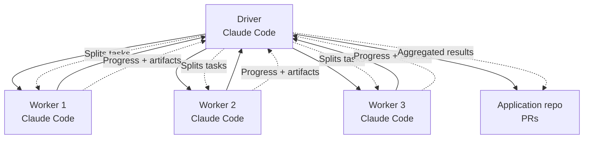

# ClaudeCluster Monorepo

ClaudeCluster is an open-source orchestration framework that transforms Claude Code into a scalable coding cluster. A single Driver coordinates multiple Worker instances in parallel, distributing coding tasks (scaffolding, refactoring, testing, docs, etc.) and aggregating results for faster delivery.

> Status: pre-release (design + prototyping). APIs and implementation details will evolve.

---

## 🏗️ Monorepo Architecture

This project is organized as a monorepo with the following structure:

```
claudecluster/
├── packages/           # Core framework packages
│   ├── core/          # Core types and interfaces
│   ├── worker/        # Worker implementation
│   ├── driver/        # Driver orchestration
│   └── shared/        # Shared utilities and config
├── apps/              # Applications (future development)
│   ├── web-dashboard/ # Web management interface (planned)
│   └── desktop-client/# Desktop application (planned)
├── tools/             # Development and project management tools
│   ├── taskmaster/    # Task Master MCP - project planning tool
│   ├── cli/           # Command line interface
│   └── setup/         # Setup and configuration scripts
└── docs/              # Documentation
    └── ARCHITECTURE.md # Detailed architecture documentation
```

---

## 🚀 Quick Start

### Prerequisites

- Node.js 18+ and npm
- Git (for version control)

### Installation

```bash
# Clone the repository
git clone https://github.com/moshinhashmi/claudecluster.git
cd claudecluster

# Install dependencies
npm install

# Setup the project
npm run setup

# Start Task Master AI
npm run taskmaster
```

### Development Commands

```bash
# Build all packages
npm run build

# Start development mode
npm run dev

# Run tests
npm run test

# Run tests with coverage
npm run test:coverage

# Lint code
npm run lint

# Fix linting issues
npm run lint:fix

# Format code
npm run format

# Check TypeScript types
npm run types:check

# Security audit
npm run security:audit

# Generate changelog
npm run changelog

# Test release (dry run)
npm run release:dry-run

# Clean build artifacts
npm run clean
```

---

## 📦 Package Overview

### Core Packages

- **`@claudecluster/core`** - Core framework types, interfaces, and base classes
- **`@claudecluster/worker`** - Worker implementation for executing Claude Code tasks
- **`@claudecluster/driver`** - Driver orchestration and task management
- **`@claudecluster/shared`** - Shared utilities, configurations, and common code

### Tools

- **`@claudecluster/taskmaster`** - Web-based task management dashboard
- **`@claudecluster/cli`** - Command-line interface for task management

---

## 🎯 Why ClaudeCluster?

- **Parallelism** → Run multiple Claude Code sessions at once for maximum throughput
- **Scalability** → Spin up workers locally or across Kubernetes nodes
- **Transparency** → Live logs, progress streaming, and artifacts per task
- **Enterprise-ready** → Patent-safe Apache 2.0 license, structured governance

---

## 🏗️ Architecture Overview



### Core Concepts

- **Driver**: Receives a high-level goal, plans a task graph, and orchestrates execution
- **Worker**: Runs an isolated Claude Code session to execute a specific task
- **Task**: A well-scoped unit of work (e.g., scaffold feature, refactor module, add tests, write docs)
- **Artifacts**: Outputs from tasks (diffs, files, logs, test results) captured and aggregated by the Driver

---

## 🔧 Development

### Workspace Management

This monorepo uses npm workspaces for package management:

```bash
# Install dependencies for a specific package
npm install --workspace=@claudecluster/core

# Run scripts for a specific package
npm run build --workspace=@claudecluster/core

# Run scripts across all workspaces
npm run build --workspaces
```

### Package Dependencies

Packages can depend on each other using workspace references:

```json
{
  "dependencies": {
    "@claudecluster/core": "workspace:*"
  }
}
```

### Building and Testing

```bash
# Build all packages
npm run build

# Build specific package
npm run build --workspace=@claudecluster/core

# Run tests across all packages
npm run test

# Run tests for specific package
npm run test --workspace=@claudecluster/core
```

---

## 📊 Features

- **Parallel orchestration** of multiple Claude Code sessions
- **Task graph + scheduling** with retries, deduplication, and map/merge patterns
- **Live progress streaming** and structured logs
- **Per-task artifacts**: files, diffs, test reports, benchmarks
- **Pluggable runners**: Local process, Docker, Kubernetes
- **Interfaces**: CLI and HTTP API for integration into CI/CD and tools
- **Observability**: Metrics and traces (OpenTelemetry), audit-friendly logs
- **Policy & safety**: token budgeting, network/FS guardrails, secrets management
- **Enterprise**: multi-tenant projects, role-based access, approvals

---

## 🛠️ Tools

### Task Master AI

The Task Master AI provides a web-based dashboard for managing ClaudeCluster tasks:

- **Web Dashboard**: http://localhost:3000
- **API Endpoints**: http://localhost:3000/api/*
- **CLI Interface**: `npm run cli`

### Development Tools

- **Lerna**: Monorepo management and versioning
- **Turbo**: Build system and caching with intelligent incremental builds
- **Nx**: Task execution and dependency management
- **TypeScript**: Type safety across all packages
- **ESLint**: Code linting with TypeScript support
- **Prettier**: Code formatting and style consistency
- **Husky**: Git hooks for quality enforcement
- **lint-staged**: Pre-commit linting for staged files
- **Commitlint**: Conventional commit message validation
- **Semantic-release**: Automated versioning and package publishing
- **Codecov**: Code coverage reporting and tracking

---

## 🚀 Roadmap

### Phase 1: Infrastructure ✅
- [x] Monorepo structure and tooling
- [x] Enterprise-grade development toolchain
- [x] CI/CD pipeline with quality gates
- [x] Documentation and architecture design

### Phase 2: Core Framework (Next)
- [ ] Core framework implementation
- [ ] Worker implementation
- [ ] Driver orchestration logic
- [ ] Claude API integration
- [ ] Task execution engine

### Phase 3: Applications (Future)
- [ ] Web dashboard application
- [ ] Desktop client application
- [ ] Mobile companion app
- [ ] CLI enhancements

### Phase 4: Production Features (Future)
- [ ] Docker and Kubernetes runners
- [ ] Git integrations (PRs, review summaries)
- [ ] Secrets management + policy guardrails
- [ ] Observability (metrics, traces)
- [ ] SDKs (TypeScript/Python)
- [ ] Test harness + sample projects

---

## 🤝 Contributing

Contributions are welcome! This project is early—design docs, prototypes, and doc improvements are especially helpful.

1. Open an Issue to discuss ideas, bugs, or features
2. For larger changes, start with an RFC Issue to converge on design
3. Submit a PR with focused edits and clear rationale

Please read `docs/CONTRIBUTING.md` for our contribution process, DCO sign-off, and conventional commits.

---

## 📚 Documentation

- **Setup Guide**: `tools/setup/TASKMASTER_SETUP.md`
- **API Reference**: Built into Task Master AI
- **Architecture**: See this README and package-specific docs

---

## 📄 License

Licensed under the Apache License, Version 2.0. See the `LICENSE` file for details.

---

## 🏷️ Trademarks

"Claude" and "Claude Code" are trademarks of their respective owners. This project is community-led and not affiliated with or endorsed by Anthropic.

