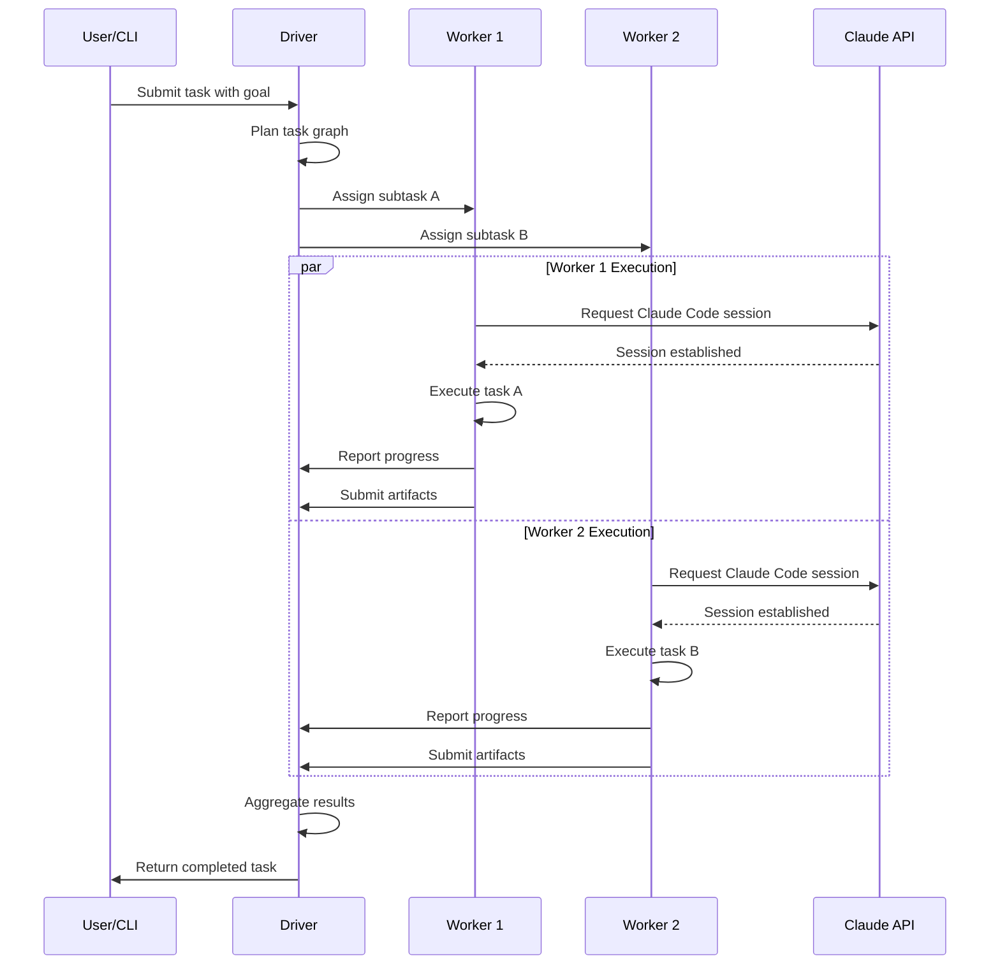

# ClaudeCluster Architecture

## Monorepo Structure

```
claudecluster/
├── packages/               # Core framework packages
│   ├── core/              # Core types, interfaces, and base classes
│   ├── driver/            # Driver orchestration and task management
│   ├── worker/            # Worker implementation for executing tasks
│   └── shared/            # Shared utilities, configurations, and common code
├── apps/                  # Applications and user interfaces
│   └── taskmaster/        # Web-based task management dashboard
├── tools/                 # Development tools and scripts
│   ├── cli/               # Command-line interface
│   └── scripts/           # Build and deployment scripts
├── docs/                  # Documentation
│   ├── CONTRIBUTING.md    # Contribution guidelines
│   └── ARCHITECTURE.md    # This file
└── tests/                 # Integration tests
```

## Core Components

### Driver (`@claudecluster/driver`)
- Orchestrates task execution across multiple workers
- Plans task graphs and manages dependencies
- Aggregates results and handles retries
- Provides REST API for external integrations

### Worker (`@claudecluster/worker`)
- Executes isolated Claude Code sessions
- Handles task-specific execution contexts
- Reports progress and produces artifacts
- Supports multiple runtime environments

### Core (`@claudecluster/core`)
- Defines TypeScript interfaces and types
- Provides base classes for drivers and workers
- Implements core orchestration algorithms
- Handles task graph management

### Shared (`@claudecluster/shared`)
- Common utilities and helper functions
- Configuration management
- Logging and observability utilities
- Network and file system abstractions

## Applications

### Task Master (`@claudecluster/taskmaster`)
- Web-based dashboard for task management
- Real-time progress monitoring
- Artifact visualization and download
- Administrative controls and settings

### CLI (`@claudecluster/cli`)
- Command-line interface for ClaudeCluster
- Task submission and monitoring
- Configuration management
- Development and debugging tools

## Technology Stack

### Core Framework
- **TypeScript**: Type-safe development
- **Node.js**: Runtime environment
- **Express**: Web server framework
- **WebSockets**: Real-time communication

### Build & Development
- **Turbo**: Monorepo build system
- **Lerna**: Package versioning and publishing
- **ESLint**: Code linting
- **Prettier**: Code formatting
- **Jest**: Testing framework

### CI/CD & Quality
- **GitHub Actions**: Continuous integration
- **Husky**: Git hooks
- **Commitlint**: Commit message validation
- **Docker**: Containerization (planned)
- **Kubernetes**: Orchestration (planned)

## Task Flow



## Deployment Architecture

### Local Development
- All components run as npm workspaces
- Single Node.js process for development
- Hot reload and live monitoring

### Production (Planned)
- Docker containers for each component
- Kubernetes orchestration
- Horizontal scaling of workers
- Persistent storage for artifacts
- Load balancing and service discovery

## Data Flow

1. **Task Submission**: User submits high-level goal via CLI or web interface
2. **Planning**: Driver analyzes goal and creates task graph with dependencies
3. **Scheduling**: Tasks assigned to available workers based on capacity
4. **Execution**: Workers establish Claude Code sessions and execute tasks
5. **Monitoring**: Real-time progress updates streamed to dashboard
6. **Aggregation**: Driver collects artifacts and assembles final results
7. **Delivery**: Completed work delivered as files, diffs, or pull requests